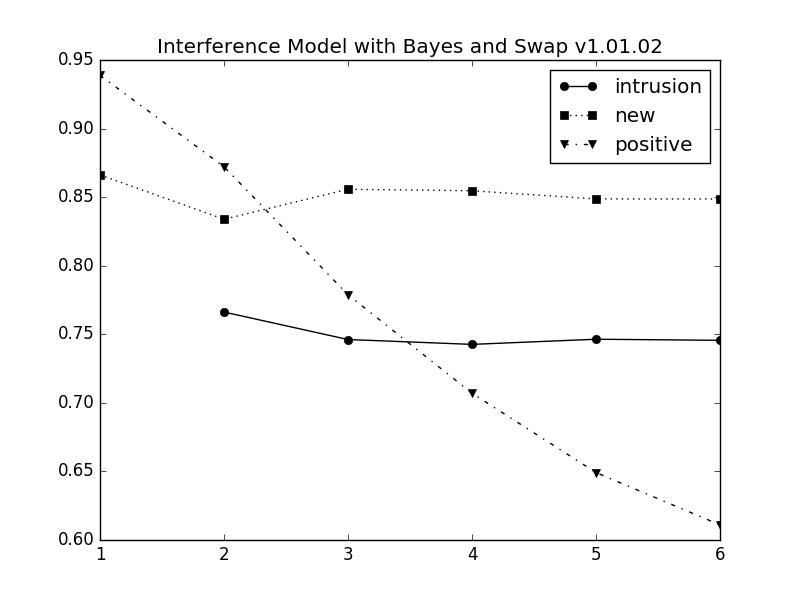

```{r setup, include=FALSE}
knitr::opts_chunk$set(echo = FALSE)
```

## Recognition Task with Continuous Stimuli
<center>
```{r, out.width = "700px"}

```
</center>

## Recognition Task with Continuous Stimuli
<center>
```{r, out.width = "700px"}

```
</center>

## Recognition Task with Continuous Stimuli
Probes:

<div class="columns-2">
  1. <div class='red'>Positive</div>
    + sampled around the color of the target
    + "No Change"
  2. Intrusion
  3. New
  
  
  
  ```{r, out.width = "350px"}
  
  ```
  
</div>

## Recognition Task with Continuous Stimuli
Probes:

<div class="columns-2">
  1. Positive
  2. <div class='red'>Intrusion</div>
    + sampled from the color of the non-target
    + "Change"
    + Internal change
  3. New
  
  
  
  ```{r, out.width = "350px"}
  
  ```
  
</div>

## Recognition Task with Continuous Stimuli
Probes:

<div class="columns-2">
  1. Positive
  2. Intrusion
  3. <div class='red'>New</div>
      + sampled from the unused color
      + "Change"
      + External change
  
  
  
  ```{r, out.width = "350px"}
  
  ```
  
</div>

## Recognition Task with Continuous Stimuli
<center>
```{r, out.width = "480px"}

```
```{r, out.width = "480px"}

```
</center>

## Modeling
###IM + Bayes Inference Rule

#### IM:

- Interference Model
- Developed for continuous reconstruction task, aka, Colorwheel task.

#### Bayes Inference Rule:

- Was implemented to Slot-averaging and Variable Precision model by Keshvari, van den Berg, & Ma (2013).
- The IM version is developed by Klaus and Wei Ji Ma.

## Inference Rule {.smaller}
The one and only equation:

$$ \begin{align*}
d &= log \left [\frac{p(C=1|x, \varphi )}{p(C=0|x, \varphi )} \right ]\\ 
 &= log \left [\frac{p(x, \varphi |C=1)}{p(x, \varphi |C=0)} \right ]\\ 
 &= \text{BLACK MAGIC}\\
 &=-log\left \{  2\pi \left [ p(S_1)D(x;\varphi ) + (1-p(S_1))\frac{1}{2\pi} \right ] \right \}
\end{align*} $$

$C=1$: "change"; $C=0$: "no change";

$x$: retrieved instance at probed location;

$\varphi$: probe;

$p(S_1)$: proportion of activation from the item at the probed location. 

<div class = "notes">
- Several goats are sacrificed to create this equation.
- Given the probe color and the location. Participants tried to recall one instance at the probed location.

</div>

## Inference Rule {.smaller}
The one and only equation:

$$ \begin{align*}
d &= log \left [\frac{p(C=1|x, \varphi )}{p(C=0|x, \varphi )} \right ]\\ 
 &= log \left [\frac{p(x, \varphi |C=1)}{p(x, \varphi |C=0)} \right ]\\ 
 &= \text{BLACK MAGIC}\\
 &=-log\left \{  2\pi \left [ p(S_1)D(x;\varphi ) + (1-p(S_1))\frac{1}{2\pi} \right ] \right \}
\end{align*} $$

Assumptions:

1. Participants are aware of the probability of recalling an item.
2. The probe in the change response is assumed as an uniformly distributed on the color wheel. 

## Simulation{.smaller}
<div class="columns-2">
###Data
```{r, out.width = "480px"}

```

###Vanilla IMBayes
```{r, out.width = "480px"}

```
</div>

- Set size 2.
- Intrusion probes.

## Simulation{.smaller}
<div class="columns-2">
###Data
```{r, out.width = "480px"}

```

###Normalized Distance IMBayes
```{r, out.width = "480px"}

```
</div>

- Slightly better, but just slightly.
- Model Name: Interference Model with Bayes Vanilla, AIC: 10246.176342182818
- Model Name: Interference Model with Bayes Normalized Distance, AIC: 10215.852985319874

## Conclusion

The addon seems to work.

- The model CAN predit the right pattern of set-size effect.
- The major misfit comes from set-size 2 and intrusion probe.

## Few more goats later
Change the assumption

- The probe in the change response is assumed as an uniformly distributed on the color wheel.

to

- The probe in the change response is assumed as an uniformly distributed on the color wheel 50% of the time and selected from non-target color 50% of the time. 

## Few more goats later{.smaller}
<div class="columns-2">
###Data
```{r, out.width = "480px"}

```

###IMBayes Swap
```{r, out.width = "480px"}

```
</div>

- ......
- Model Name: Interference Model with Bayes and Swap v1.01.02, AIC: 10228.08080848

# Thanks for your attention

## Reaction Time
```{r, out.width = "480px"}

```

## Simulated Response Distribution
<div class="columns-2">
###Vanilla IMBayes
```{r, out.width = "480px"}

```

###Normalized Distance IMBayes
```{r, out.width = "480px"}

```
</div>