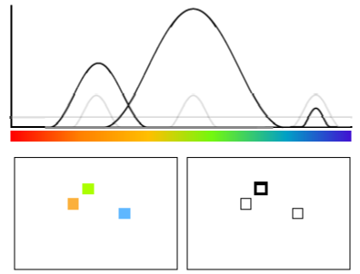
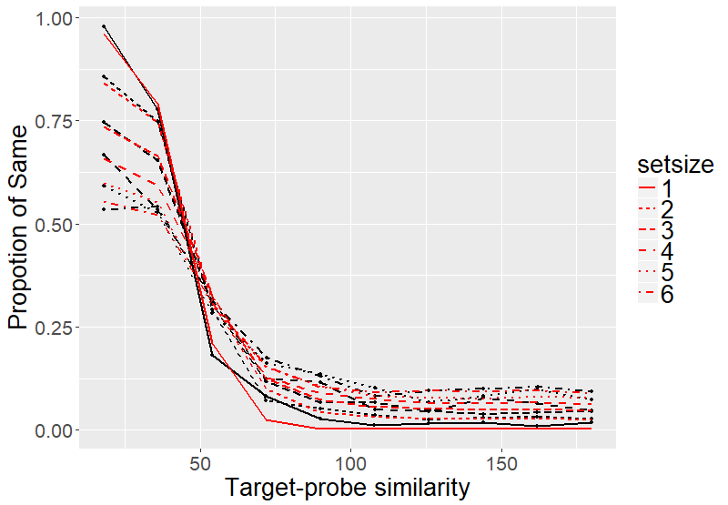

```{r setup, include=FALSE}
knitr::opts_chunk$set(echo = FALSE, warning = FALSE)
library(circular)
library(latex2exp)
```

## From Recall to Recognition

- Many of the "famous" visual-working memory models are recall model.
    - Slot-averaging model.
    - Variable-precision model.
    - Interference model.
    
- However, models for change-detection task are rare. 
- Luckily, someone fixed the problem.
- Let's look at the task first.

## Change-Detection Task

<center>
```{r, out.width = "900px"}

```
</center>

## Change-Detection Task

- 20 participants from UZH
- Material: Colors from continuous colorwheel.
- Manipulations: Set sizes (1-6) and probe type (same, change)
- 2640 trials per participants.

<center>
```{r, out.width = "600px"}
knitr::include_graphics("images/probe_manipulation.png")
```
</center>

## Results

<div class="columns-2">
Set-size effect
<center>
```{r, out.width = "500px"}

```
</center>


Similarity gradient
<center>
```{r, out.width = "500px"}

```
</center>
</div>

## Bayesian Inference (Keshvari, van den Berg, & Ma, 2013)

$$ d(x, \varphi) = \log[\frac{p("change"|x, \varphi)}{p("same"|x, \varphi)}] \\
= \log[\frac{p(x, \varphi|"change")\cdot p("change")}{p(x, \varphi|"same")\cdot p("same")}]$$

$x$: Retrieved instance at the probed location.
$\varphi$: color of the probe.

- Respond "change" if d > 0.
- "same" otherwise.

$$ P_{change}(\varphi) = \int [d(x, \varphi) > 0] \cdot P_{recall}(x)$$

## Bayesian Inference

$$ P_{change}(\varphi) = \int [d(x, \varphi) > 0] \cdot P_{recall}(x)$$
<center>
```{r, echo = FALSE}
unif <- function(x) dcircularuniform(x)
plot(unif, xlim = c(-pi, pi), ylab = 'pdf', ylim = c(0, 1.5), col = 'black', type = 'n')
# legend('topright', legend = c("same"), col = c('black'))
```
</center>

## Bayesian Inference

$$ P_{change}(\varphi) = \int [d(x, \varphi) > 0] \cdot P_{recall}(x)$$
<center>
```{r, echo = FALSE}
unif <- function(x) dcircularuniform(x)
plot(unif, xlim = c(-pi, pi), ylab = 'pdf', ylim = c(0, 1.5), col = 'black')
legend('topright', legend = c("change"), col = c('black'), lty=1, cex=0.8)
```
</center>

## Bayesian Inference

$$ P_{change}(\varphi) = \int [d(x, \varphi) > 0] \cdot P_{recall}(x)$$
<center>
```{r, echo = FALSE}
unif <- function(x) dcircularuniform(x)
SA <- function(x) dvonmises(x, mu = 0, kappa = 15) * 0.8 + dcircularuniform(x) * 0.2
plot(unif, xlim = c(-pi, pi), ylab = 'pdf', ylim = c(0, 1.5), col = 'black',  main = TeX('Mixture model with P_m = .8, $\\kappa = 15$'))
plot(SA, xlim = c(-pi, pi), col = 'blue', add = TRUE,)
legend('topright', legend = c("change", 'same'), col = c('black', 'blue'), lty=1, cex=0.8)
```
</center>

## Bayesian Inference

$$ P_{change}(\varphi) = \int [d(x, \varphi) > 0] \cdot P_{recall}(x)$$
<center>
```{r, echo = FALSE}
unif <- function(x) dcircularuniform(x)
SA <- function(x) dvonmises(x, mu = 0, kappa = 15) * 0.2 + dcircularuniform(x) * 0.8
plot(unif, xlim = c(-pi, pi), ylab = 'pdf', ylim = c(0, 1.5), col = 'black',  main = TeX('Mixture model with P_m = .2, $\\kappa = 15$'))
plot(SA, xlim = c(-pi, pi), col = 'blue', add = TRUE,)
legend('topright', legend = c("change", 'same'), col = c('black', 'blue'), lty=1, cex=0.8)
```
</center>

## Bayesian Inference

$$ P_{change}(\varphi) = \int [d(x, \varphi) > 0] \cdot P_{recall}(x)$$
<center>
```{r, echo = FALSE}
unif <- function(x) dcircularuniform(x)
SA <- function(x) dvonmises(x, mu = 0, kappa = 2) * 0.8 + dcircularuniform(x) * 0.2
plot(unif, xlim = c(-pi, pi), ylab = 'pdf', ylim = c(0, 1.5), col = 'black',  main = TeX('Mixture model with P_m = .8, $\\kappa = 2$'))
plot(SA, xlim = c(-pi, pi), col = 'blue', add = TRUE,)
legend('topright', legend = c("change", 'same'), col = c('black', 'blue'), lty=1, cex=0.8)
```
</center>

## Interference Model

- Recall process activate all the possible response candidates.
- The response candidates compete with each others.
- Larger activation results in higher probability of being recalled.
- The activation of a candidate is calculated as:

$$ A(x|L_\theta) = a A_a(x) + bA_b(x) + cA_c(x|L_\theta)$$

- The activation ($A$) of the response candidate ($x$) when location $\theta$ ($L_\theta$)is probesd is the combination of three activation ($A_a$, $A_b$, and $A_c$) with their corresponding weights ($a$, $b$, and $c$).

## Interfernce Model

$$A(x|L_\theta) = a \color{red}{A_a(x)} + bA_b(x) + cA_c(x|L_\theta)$$

- Activation from context-independent source.
- Activated by recently experienced items regardless the location of probe and the location of items.

<center>
```{r, out.width = "400px"}
knitr::include_graphics("images/a_component.png")
```
</center>


## Interfernece Model

$$A(x|L_\theta) = a A_a(x) + b\color{red}{A_b(x)} + cA_c(x|L_\theta)$$

- Background-noise activation.
- Byproduct of the encoding process.
- Every response candidate received the same background-noise activation.

<center>
```{r, out.width = "400px"}

```
</center>

## Interference Model

$$A(x|L_\theta) = a A_a(x) + bA_b(x) + c\color{red}{A_c(x|L_\theta)}$$

- Cued-retrieval activation.
- Activated by reactivate the location-color binding formed during the encoding process.

<center>
```{r, out.width = "400px"}

```
</center>

## Interference Model

$$A(x|L_\theta) = a A_a(x) + bA_b(x) + c\color{red}{A_c(x|L_\theta)}$$

- Cued-retrieval activation.
- Activated by reactivate the location-color binding formed during the encoding process.

<center>
```{r, out.width = "800px"}
knitr::include_graphics("images/c_component_b.png")
```
</center>

## Interference Model

- That's all!
- Except of "focus of attention".
- Interference comes from:
    - Cued retrieval.
    - Competition between response candidates.
- Chance of getting into focus of attention reduced when set size increases.

## Result

- IM predicts the interference from non-target items.

- Recagegorized probes into:
<center>
```{r, out.width = "800px"}

```
</center>


## Recategorized results

Set-size effect
<center>
```{r, out.width = "700px"}

```
</center>


## IM Prediction

<div class="columns-2">
Set-size effect
<center>
```{r, out.width = "500px"}

```
</center>


Similarity gradient
<center>
```{r, out.width = "500px"}

```
</center>
</div>

## IM Prediction

<div class="columns-2">
Set-size effect
<center>
```{r, out.width = "500px"}

```
</center>


Similarity gradient
<center>
```{r, out.width = "500px"}

```
</center>
</div>

## Slot-averaging Model

<div class="columns-2">
Set-size effect
<center>
```{r, out.width = "500px"}

```
</center>


Similarity gradient
<center>
```{r, out.width = "500px"}
knitr::include_graphics("images/SA_distribution_reducted.png")
```
</center>
</div>

## Variable Percision Model

<div class="columns-2">
Set-size effect
<center>
```{r, out.width = "500px"}

```
</center>


Similarity gradient
<center>
```{r, out.width = "500px"}

```
</center>
</div>

## So That Happened

- SA and VP performed really poorly.
- Let's help them a bit.

## SA-Swap

- Swap could happen between items.
- Probability of swap happening increases with set-sizes.

<div class="columns-2">
Set-size effect
<center>
```{r, out.width = "500px"}

```
</center>


Similarity gradient
<center>
```{r, out.width = "500px"}
knitr::include_graphics("images/SA_swap_distribution_reducted.png")
```
</center>
</div>


## VP-Binding

- Assumes color-location binding.
- Resources allocated to an item also determines the strength of binding.

<div class="columns-2">
Set-size effect
<center>
```{r, out.width = "500px"}

```
</center>


Similarity gradient
<center>
```{r, out.width = "500px"}

```
</center>
</div>

## Conclusion

- IM still owns SA and VP.
    - Even after adding extra assumptions to SA and VP.
- However, inference rule has some issues.
    - The amount of knowledge involved in the inference rule.

## Knowledge in Inference Rule

- Inference rule knows the memory state of the target.

<div class="columns-2">

```{r, echo = FALSE, out.width = "500px"}
unif <- function(x) dcircularuniform(x)
SA <- function(x) dvonmises(x, mu = 0, kappa = 15) * 1.0 + dcircularuniform(x) * 0.0
plot(unif, xlim = c(-pi, pi), ylab = 'pdf', ylim = c(0, 1.5), col = 'black',  main = TeX('In slot state, P_m = 1.0'))
plot(SA, xlim = c(-pi, pi), col = 'blue', add = TRUE,)
legend('topright', legend = c("change", 'same'), col = c('black', 'blue'), lty=1, cex=0.8)
```

```{r, echo = FALSE, out.width = "500px"}
unif <- function(x) dcircularuniform(x)
SA <- function(x) dvonmises(x, mu = 0, kappa = 15) * 0.0 + dcircularuniform(x) * 1.0
plot(unif, xlim = c(-pi, pi), ylab = 'pdf', ylim = c(0, 1.5), col = 'black',  main = TeX('Not in slot state, P_m = 0.0'))
plot(SA, xlim = c(-pi, pi), col = 'blue', add = TRUE,)
legend('topright', legend = c("change", 'same'), col = c('black', 'blue'), lty=1, cex=0.8)
```

</div>

## Knowledge in Inference Rule

- Inference rule only knows the general probability of having target in memory.
```{r, echo = FALSE, out.width = "500px"}
unif <- function(x) dcircularuniform(x)
SA <- function(x) dvonmises(x, mu = 0, kappa = 15) * 0.8 + dcircularuniform(x) * 0.2
plot(unif, xlim = c(-pi, pi), ylab = 'pdf', ylim = c(0, 1.5), col = 'black',  main = TeX('In slot state, P_m = 0.8'))
plot(SA, xlim = c(-pi, pi), col = 'blue', add = TRUE,)
legend('topright', legend = c("change", 'same'), col = c('black', 'blue'), lty=1, cex=0.8)
```

## Knowledge in Inference Rule

<div class="columns-2">
Knowledge
<center>
```{r, out.width = "500px"}

```
</center>


Only general knowledge
<center>
```{r, out.width = "500px"}
knitr::include_graphics("images/SA_Intergrat_setsize.png")
```
</center>
</div>

## Knowledge in Inference Rule

- There are more to consider:
    - Recall precision
    - "change" distribution

- Things are even more complicated in IM
    - Is target in the focus of attention?
    - Probability of recalling the target?

# That's all


## Spatial Gradient Effect

<center>
```{r, out.width = "700px"}
knitr::include_graphics("images/Spatial_gradient.png")
```
</center>