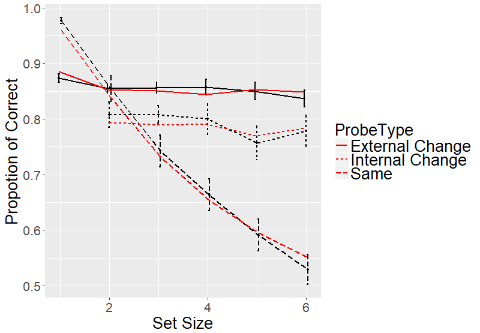
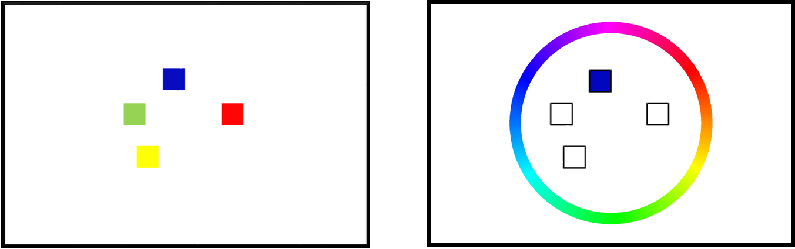
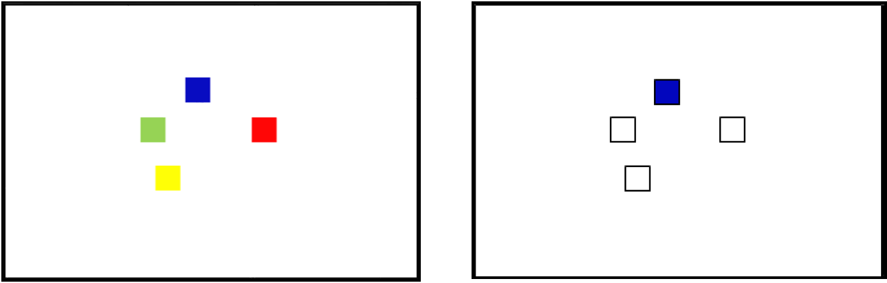
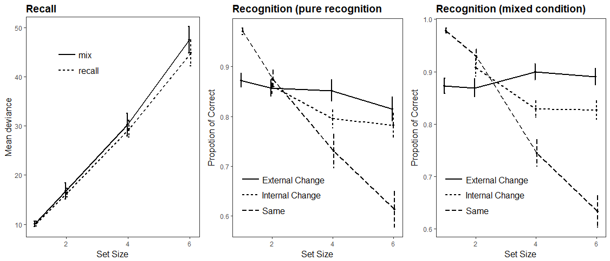

```{r setup, include=FALSE}
knitr::opts_chunk$set(echo = FALSE)
library(ggplot2)
library(circular)
library(jtools)
library(cowplot)
options(warn=-1)
```

## Previously, in the last episode ...

- We fitted the Interference Model to Single-probe Change-detection task with the help of Bayesian inference rule.
    - and we did good.

<center>
```{r, out.width = "360px", eval = TRUE, echo = FALSE}
  
  knitr::include_graphics("images/IM_distribution_reducted.png")
```
</center>
## However

- Since we have a model which can fit bot recall and recognition task.
    - Can we do it at the same time?
    - Why?

- Do recall and recognition share similar retrieval process?
    - It seems intuitive
    - But not many models can do it.

- Do recall and recognition process tap into the same memory representation?
    - Check if the mixture model estimated similar parameters for both recall and recognition


## Mixture model

```{r, echo = FALSE, include = TRUE, fig.height=4, fig.width=5.5}
x = seq(-pi, pi, 0.01)

guessing = rep(1/(2*pi), length(x))
memory = dvonmises(x, mu = 0, kappa = 5)
p_m = 0.7
recall = memory*p_m + guessing*(1-p_m)

guessing = guessing / sum(guessing)
memory = memory / sum(memory)
recall = recall / sum(recall)

mixture_model <- data.frame(cbind(x, guessing, memory, recall))

ggplot(data=mixture_model, aes(x=x)) +
  geom_line(aes(y=guessing, colour = 'Guessing'), linetype = 'dashed', size = 1) +
  geom_line(aes(y=memory, colour = 'Memory'), linetype = 'dashed', size = 1) +
  geom_line(aes(y=recall, colour = 'Recall'), linetype = 'solid', size = 2) +
  scale_colour_manual(values=c(Guessing="red", Memory="black", Recall="black")) +
  xlab('Deviant from target color') +
  ylab('Probability of recall') +
  scale_x_continuous(breaks = c(-pi, -pi/2, 0, pi/2, pi), labels = c(expression(-pi), expression(-pi/2), '0', expression(pi/2), expression(pi)))+
  jtools::theme_apa() +
  theme(legend.position=c(0.8, 0.8))
```

- Two parameters:
    - $\kappa$: precision of the memory
    - $P_m$: probability of recalling the target

## Bayesian inference rule

- To adapt the recall model to recognition, we used the Bayesian inference rule.

$$ d(x, \varphi) = \log[\frac{p("change"|x, \varphi)}{p("same"|x, \varphi)}] \\
= \log[\frac{p(x, \varphi|"change")\cdot p("change")}{p(x, \varphi|"same")\cdot p("same")}]$$

- You recall the color from the probed location $x$ and, given the probe color $\varphi$, evaluate the probability of _change_ or _same_.
- When $d(x, \varphi) > 0$, the probe is more likely coming from _change_ condition, 
- and vice versa.

## Bayesian inference rule

<div class="columns-2">

```{r, echo = FALSE, include = TRUE, fig.height=3.3, fig.width=4.7}
x = seq(-pi, pi, 0.01)

change = rep(1/(2*pi), length(x))

guessing = rep(1/(2*pi), length(x))
memory = dvonmises(x, mu = 0, kappa = 5)
p_m = 0.7
same = memory*p_m + guessing*(1-p_m)

change = change / sum(change)
same = same / sum(same)

mixture_model <- data.frame(cbind(x, change, same))

ggplot(data=mixture_model, aes(x=x)) +
  geom_line(aes(y=change, colour = 'Change'), size = 1) +
  geom_line(aes(y=same, colour = 'Same'), size = 1) +
  scale_colour_manual(values=c(Change="red", Same="black")) +
  xlab('recalled color x') +
  ylab('Assumed probability of recall') +
  scale_x_continuous(breaks = c(-pi, -pi/2, 0, pi/2, pi), labels = c(expression(varphi-pi), expression(varphi-pi/2), expression(varphi), expression(varphi+pi/2), expression(varphi+pi)))+
  jtools::theme_apa() +
  theme(legend.position=c(0.8, 0.8))
```

- If the recalled color is similar enough to the probe color, respond _same_
- Otherwise, respond _change_
- How similar is determined by the assumed recall distribution.

</div>

## Experiment

- 20 participants
- Four sessions, 512 trials per session
    - 1 session of full recall
    - 1 session of full recognition
    - 2 session of recall and recognition
- Setsize: 1, 2, 4, 6.

<center>
```{r, out.width = "720px", eval = TRUE, echo = FALSE}
  
```
</center>

## Experiment

- 20 participants
- Four sessions, 512 trials per session
    - 1 session of full recall
    - 1 session of full recognition
    - 2 session of recall and recognition
- Setsize: 1, 2, 4, 6.

<center>
```{r, out.width = "720px", eval = TRUE, echo = FALSE}
  
```
</center>

## Experiment
<center>
```{r, out.width = "900px", eval = TRUE, echo = FALSE}
  
```
</center>

## Mixture model results

```{r, echo = FALSE, include = TRUE, fig.width=9}
data <-  read.table('measurement_parms.txt', header = FALSE, fill = FALSE)
names(data) <- c('pID', 'setsize', 'model', 'kappa', 'pm', 'misc')
data$setsize <- as.factor(data$setsize)
data$setsize <- c(1, 2, 4, 6)

levels(data$model)[levels(data$model)=="MM"] <- "Recall"
levels(data$model)[levels(data$model)=="MMR"] <- "Recognition"
levels(data$model)[levels(data$model)=="MMBoundary"] <- "RecognitionBoundary"
levels(data$model)[levels(data$model)=="MMRBias"] <- "RecognitionBias"

parameters <- data[data$model == 'Recall' | data$model == 'Recognition', ]
tmp_data <- data.frame(aggregate(list(parameters$kappa, parameters$pm), list(parameters$setsize, parameters$model), mean))
tmp_data_sd <- data.frame(aggregate(list(parameters$kappa, parameters$pm), list(parameters$setsize, parameters$model), sd))
tmp_data[, 5] <- tmp_data_sd[, 3] / sqrt(20)
tmp_data[, 6] <- tmp_data_sd[, 4] / sqrt(20)
names(tmp_data) <- c('Setsize', 'Task', 'Kappa', 'PM', 'Kappa_SE', 'PM_SE')
pd <- position_dodge(.1)
p_kappa= ggplot(data=tmp_data) + aes(x=Setsize, y = Kappa, linetype = Task) + 
  geom_line(position = pd, size = 1) + 
  geom_errorbar(aes(ymin=Kappa-Kappa_SE, ymax=Kappa+Kappa_SE), width=.1, position = pd, size = 1) + 
  geom_point(position = pd, size = 1) +
  #geom_line(position = pd, aes(x=Setsize, y = Murry, linetype = ProbeType, group = ProbeType), color = 'red', size = 1) +
  xlab('Set Size') +
  ylab(expression(paste('Estimated ', kappa))) +
  ggtitle(expression(kappa)) +
  scale_x_continuous(breaks = c(1, 2, 4, 6))+
  jtools::theme_apa() +
  theme(legend.position=c(0.7, 0.85))

p_PM = ggplot(data=tmp_data) + aes(x=Setsize, y = PM, linetype = Task) + 
  geom_line(position = pd, size = 1) + 
  geom_errorbar(aes(ymin=PM-PM_SE, ymax=PM+PM_SE), width=.1, position = pd, size = 1) + 
  geom_point(position = pd, size = 1) +
  #geom_line(position = pd, aes(x=Setsize, y = Murry, linetype = ProbeType, group = ProbeType), color = 'red', size = 1) +
  xlab('Set Size') +
  ylab(expression(paste('Estimated ', P[m]))) +
  ggtitle(expression(P[m])) +
  scale_x_continuous(breaks = c(1, 2, 4, 6))+
  jtools::theme_apa() +
  theme(legend.position=c(0.7, 0.2))

plot_grid(p_kappa, p_PM, nrow=1, ncol = 2)
```

- Well, that's a bit of a problem.

## Knowledge limited model

- Nosofsky & Donkin (2016):
    - One additional parameter $C$, how similar tht probe and the recalled color needs to be to be accepted.
    
```{r, echo = FALSE, include = TRUE, fig.height=3.3, fig.width=4.7}
C = 2*pi/10

mixture_model <- data.frame(cbind(x, change, same))

ggplot(data=mixture_model, aes(x=x)) +
  geom_line(aes(y=same), size = 1, color = 'black') +
  xlab('recalled color x') +
  ylab('Probability of recall') +
  geom_vline(xintercept = -2*pi/10, linetype = 'dashed', color = 'black', size = 1) +
  geom_vline(xintercept = 2*pi/10, linetype = 'dashed', color = 'black', size = 1) +
  scale_x_continuous(breaks = c(-pi, -pi/2, -2*pi/10, 0, 2*pi/10, pi/2, pi), labels = c(expression(-pi), expression(-pi/2), '-C', '0', 'C', expression(+pi/2), expression(+pi)))+
  jtools::theme_apa() +
  theme(legend.position=c(0.8, 0.8))
```

## Bayesian inference with bias

- Instead of responding _change_ when $d(x, \varphi) > 0$, the _change_ criterior is changed to
$d(x, \varphi) > b$

```{r, echo = FALSE, include = TRUE, fig.height=3.3, fig.width=4.7}
x = seq(-pi, pi, 0.01)

change = rep(1/(2*pi), length(x))

guessing = rep(1/(2*pi), length(x))
memory = dvonmises(x, mu = 0, kappa = 5)
p_m = 0.7
same = memory*p_m + guessing*(1-p_m)

change = change / sum(change)
same = same / sum(same)

mixture_model <- data.frame(cbind(x, change, same))

ggplot(data=mixture_model, aes(x=x)) +
  geom_line(aes(y=change, colour = 'Change'), size = 1) +
  geom_line(aes(y=same, colour = 'Same'), size = 1) +
  scale_colour_manual(values=c(Change="red", Same="black")) +
  xlab('recalled color x') +
  ylab('Assumed probability of recall') +
  scale_x_continuous(breaks = c(-pi, -pi/2, 0, pi/2, pi), labels = c(expression(varphi-pi), expression(varphi-pi/2), expression(varphi), expression(varphi+pi/2), expression(varphi+pi)))+
  jtools::theme_apa() +
  theme(legend.position=c(0.8, 0.8))
```

## Fitting results, again
```{r, echo = FALSE, include = TRUE, fig.width=9}
parameters <- data[data$model == 'Recall' | data$model == 'RecognitionBoundary' | data$model == 'RecognitionBias', ]
tmp_data <- data.frame(aggregate(list(parameters$kappa, parameters$pm), list(parameters$setsize, parameters$model), mean))
tmp_data_sd <- data.frame(aggregate(list(parameters$kappa, parameters$pm), list(parameters$setsize, parameters$model), sd))
tmp_data[, 5] <- tmp_data_sd[, 3] / sqrt(20)
tmp_data[, 6] <- tmp_data_sd[, 4] / sqrt(20)
names(tmp_data) <- c('Setsize', 'Task', 'Kappa', 'PM', 'Kappa_SE', 'PM_SE')
pd <- position_dodge(.1)
p_kappa= ggplot(data=tmp_data) + aes(x=Setsize, y = Kappa, linetype = Task) + 
  geom_line(position = pd, size = 1) + 
  geom_errorbar(aes(ymin=Kappa-Kappa_SE, ymax=Kappa+Kappa_SE), width=.1, position = pd, size = 1) + 
  geom_point(position = pd, size = 1) +
  #geom_line(position = pd, aes(x=Setsize, y = Murry, linetype = ProbeType, group = ProbeType), color = 'red', size = 1) +
  xlab('Set Size') +
  ylab(expression(paste('Estimated ', kappa))) +
  ggtitle(expression(kappa)) +
  scale_x_continuous(breaks = c(1, 2, 4, 6))+
  jtools::theme_apa() +
  theme(legend.position=c(0.7, 0.85))

p_PM = ggplot(data=tmp_data) + aes(x=Setsize, y = PM, linetype = Task) + 
  geom_line(position = pd, size = 1) + 
  geom_errorbar(aes(ymin=PM-PM_SE, ymax=PM+PM_SE), width=.1, position = pd, size = 1) + 
  geom_point(position = pd, size = 1) +
  #geom_line(position = pd, aes(x=Setsize, y = Murry, linetype = ProbeType, group = ProbeType), color = 'red', size = 1) +
  xlab('Set Size') +
  ylab(expression(paste('Estimated ', P[m]))) +
  ggtitle(expression(P[m])) +
  scale_x_continuous(breaks = c(1, 2, 4, 6))+
  jtools::theme_apa() +
  theme(legend.position=c(0.7, 0.2))

plot_grid(p_kappa, p_PM, nrow=1, ncol = 2)
```


## Fitting results, again
```{r, echo = FALSE, include = TRUE, fig.width=9}
pm = data[data$model == 'Recall',]
pm$recog.pm = data$pm[data$model == 'RecognitionBoundary']
pm$recog.kappa = data$kappa[data$model == 'RecognitionBoundary']

pm_plot = ggplot(data=pm) + aes(x = pm, y = recog.pm) +
  xlab(expression(paste('Estimated ', P[m], ' from recall task'))) +
  ylab(expression(paste('Estimated ', P[m], ' from recognition task'))) +
  geom_point() +
  jtools::theme_apa()

kappa_plot = ggplot(data=pm) + aes(x = kappa, y = recog.kappa) +
  xlab(expression(paste('Estimated ', kappa, ' from recall task'))) +
  ylab(expression(paste('Estimated ', kappa, ' from recognition task'))) +
  geom_point() +
  xlim(0, 100) +
  ylim(0, 100) +
  jtools::theme_apa()

plot_grid(kappa_plot, pm_plot, nrow=1, ncol = 2)

```

## Sum it up

- Knowledge limited model is mathmatically identical to the Bayesian inference rule with bias.

- After taking bias (or acceptance boundary) into account:
    - Recall and recognition tasks estimated similar memory precision.
    - The probability of recalling the target is ... off.
    - Shared representation for both recall and recognition, maybe?

# And that's it.


## Fitting results, again
```{r, echo = FALSE, include = TRUE, fig.width=9}
pm = data[data$model == 'RecognitionBias',]
pm$recog.pm = data$pm[data$model == 'RecognitionBoundary']
pm$recog.kappa = data$kappa[data$model == 'RecognitionBoundary']

pm_plot = ggplot(data=pm) + aes(x = pm, y = recog.pm) +
  xlab(expression(paste('Estimated ', P[m], ' from Bayesian bias'))) +
  ylab(expression(paste('Estimated ', P[m], ' from boundary task'))) +
  geom_point() +
  jtools::theme_apa()

kappa_plot = ggplot(data=pm) + aes(x = kappa, y = recog.kappa) +
  xlab(expression(paste('Estimated ', kappa, ' from Bayesian bias'))) +
  ylab(expression(paste('Estimated ', kappa, ' from boundary task'))) +
  geom_point() +
  xlim(0, 100) +
  ylim(0, 100) +
  jtools::theme_apa()

plot_grid(kappa_plot, pm_plot, nrow=1, ncol = 2)
```
