```{r setup, include=FALSE}
knitr::opts_chunk$set(echo = FALSE)
```

## Working Memory Capacity

- Working memory capacity has a hard limit:
    - Slot Model (Zhang & Luck, 2007)
    - Resource Model (Bays, 2008)
    
- There is no hard limit:
    - You can remeber as many item as you want.
    - Interference caused capacity "limit".
    - More items in the memory -> more interference between items
    
- Interference Model (Oberauer & Lin, 2017)
  
## Interference Model

- Recall process activate all the possible response candidates.
- The response candidates compete with each others.
- Loarger activation results in higher probability of being recalled.
- The activation of a candidate is calculated as:

$$ A(x|L_\theta) = a A_a(x) + bA_b(x) + cA_c(x|L_\theta)$$

- The activation ($A$) of the response candidate ($x$) when location $\theta$ ($L_\theta$)is probesd is the combination of three activations ($A_a$, $A_b$, and $A_c$) with their corresponding weights ($a$, $b$, and $c$).

## Interfernce Model

$$A(x|L_\theta) = a \color{red}{A_a(x)} + bA_b(x) + cA_c(x|L_\theta)$$

- Activation from context-independent source.
- Activated by recently experienced items regardless the location of probe and the location of items.

<center>
```{r, out.width = "400px"}
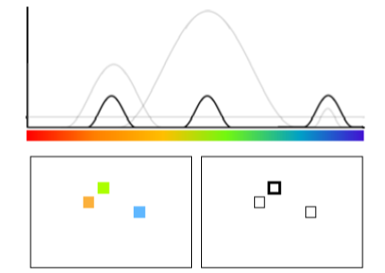
```
</center>


## Interfernece Model

$$A(x|L_\theta) = a A_a(x) + b\color{red}{A_b(x)} + cA_c(x|L_\theta)$$

- Background-noise activation.
- Byproduct of the encoding process.
- Every response candidate recieved the same background-noise activation.

<center>
```{r, out.width = "400px"}
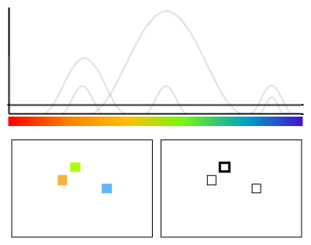
```
</center>

## Interference Model

$$A(x|L_\theta) = a A_a(x) + bA_b(x) + c\color{red}{A_c(x|L_\theta)}$$

- Cued-retrieval activation.
- Activated by reactivate the location-color binding formed during the encoding process.

<center>
```{r, out.width = "400px"}
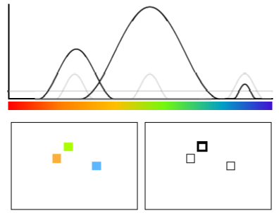
```
</center>

## Interference Model

$$A(x|L_\theta) = a A_a(x) + bA_b(x) + c\color{red}{A_c(x|L_\theta)}$$

- Cued-retrieval activation.
- Activated by reactivate the location-color binding formed during the encoding process.

<center>
```{r, out.width = "800px"}
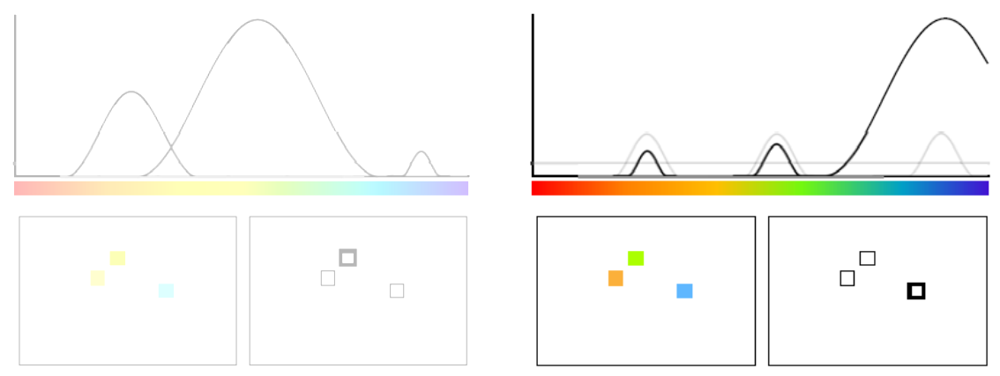
```
</center>

## Interference Model

- That's all!
- Interference comes from:
    - Cued retrieval.
    - Competition between response candidates.
    
- Previously, we implemented IM to continuous reproduction task.
- We want to extend our dominance to Change-detection task.

## Change-Detection Task

<center>
```{r, out.width = "900px"}
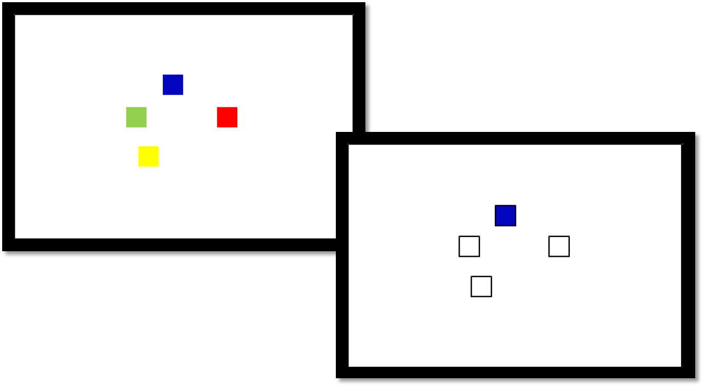
```
</center>

## Change-Detection Task

- 20 participants from UZH
- Material: Colors from continuous colorwheel.
- Manipulations: Set sizes (1-6) and probe type (same, change)
- 2640 trials per participants.

<center>
```{r, out.width = "600px"}
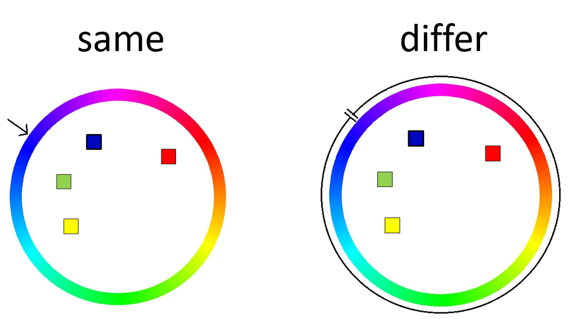
```
</center>

## Results

<div class="columns-2">
Set-size effect
<center>
```{r, out.width = "500px"}
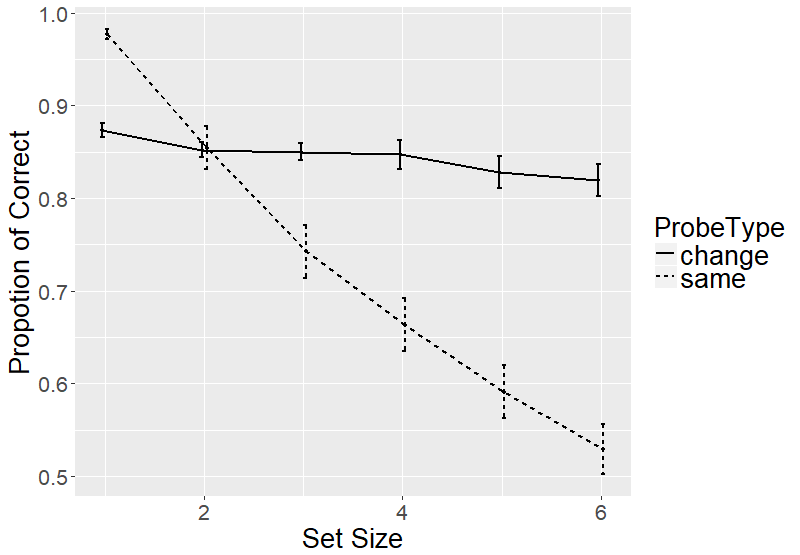
```
</center>


Similarity gradient
<center>
```{r, out.width = "500px"}
knitr::include_graphics("images/Distribution.png")
```
</center>
</div>

## Result

- IM predicts the interference from non-target items.

- Recagegorized probes into:
<center>
```{r, out.width = "800px"}
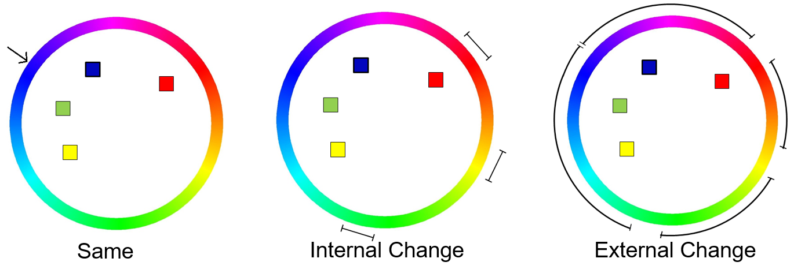
```
</center>


## Recategorized results

Set-size effect
<center>
```{r, out.width = "700px"}
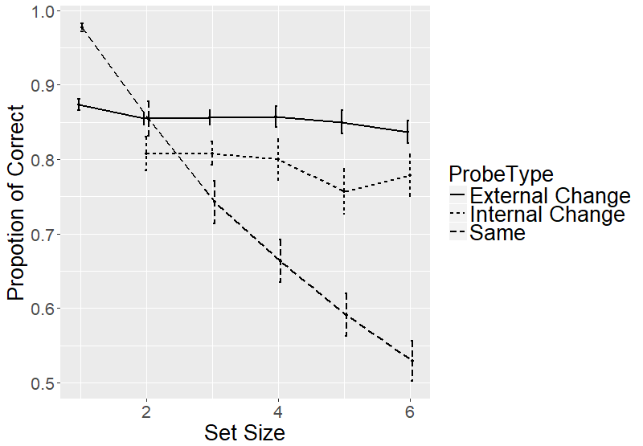
```
</center>

## Bayes Inference (Keshvari, van den Berg, & Ma, 2013)

$$ d = \log[\frac{p("change"|x, \varphi)}{p("same"|x, \varphi)}] \\
= \log[\frac{p(x, \varphi|"change")\cdot p("change")}{p(x, \varphi|"same")\cdot p("same")}]$$

$x$: Retrieved instance at the probed location.
$\varphi$: color of the probe.

## IM Prediction

<div class="columns-2">
Set-size effect
<center>
```{r, out.width = "500px"}
knitr::include_graphics("images/IM_setsize.png")
```
</center>


Similarity gradient
<center>
```{r, out.width = "500px"}
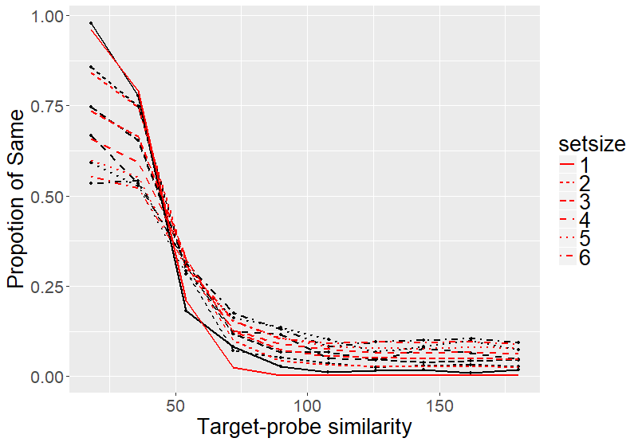
```
</center>
</div>

## IM Prediction

<div class="columns-2">
Set-size effect
<center>
```{r, out.width = "500px"}
knitr::include_graphics("images/IM_setsize.png")
```
</center>


Similarity gradient
<center>
```{r, out.width = "500px"}
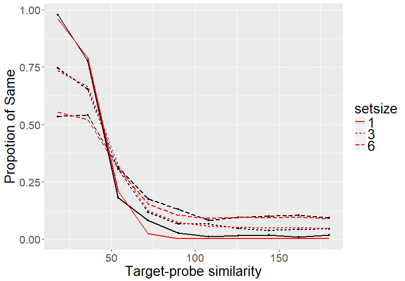
```
</center>
</div>

## Slot-averaging Model

<div class="columns-2">
Set-size effect
<center>
```{r, out.width = "500px"}
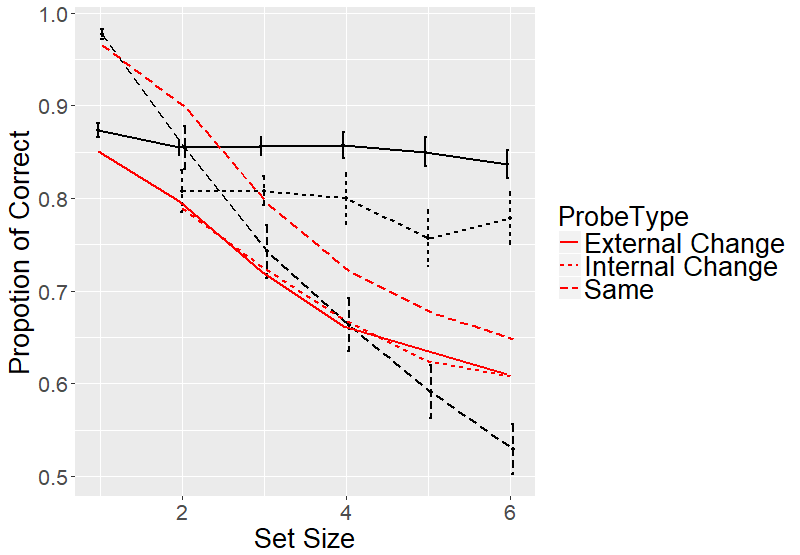
```
</center>


Similarity gradient
<center>
```{r, out.width = "500px"}
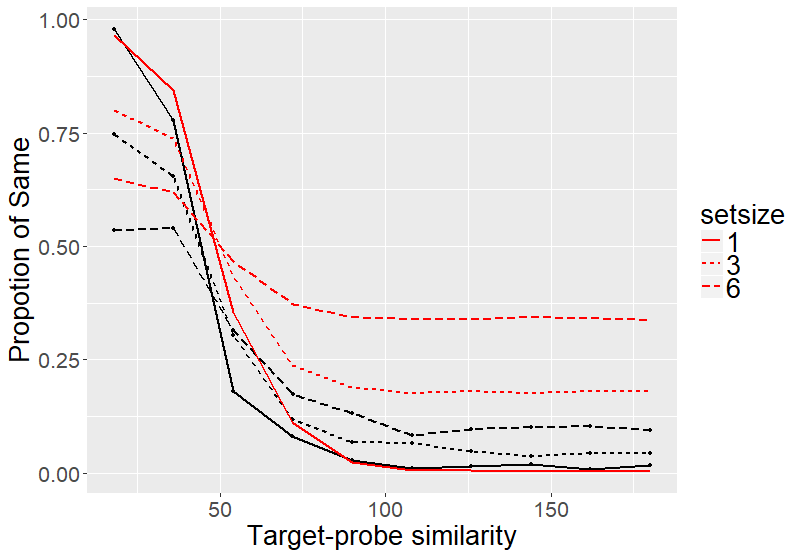
```
</center>
</div>

## Variable Percision Model

<div class="columns-2">
Set-size effect
<center>
```{r, out.width = "500px"}

```
</center>


Similarity gradient
<center>
```{r, out.width = "500px"}
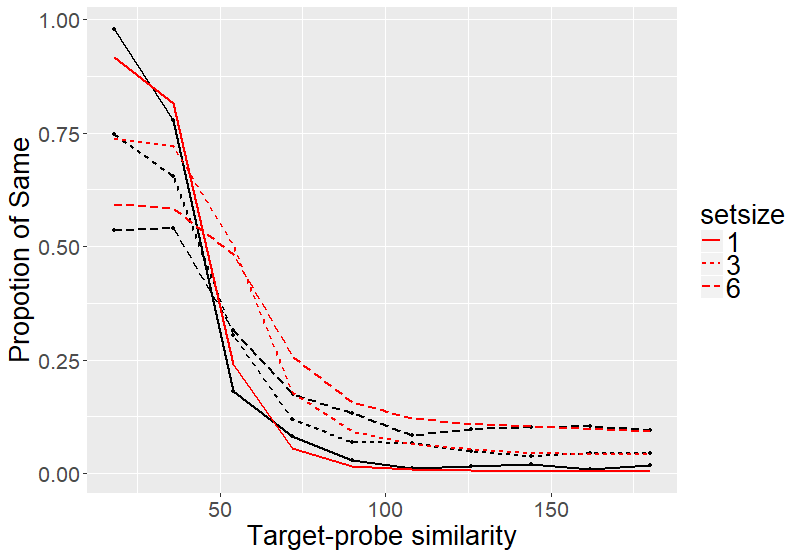
```
</center>
</div>


## Conclusion

- Interference model can predict the intrusion cost.
- SA and VP could not without additional assumptions.

- Maybe we don't need a hard capacity limit for working memory.

# Thanks for your attention

## SA-Swap

- Swap could happen between items.
- Probability of swap happening increases with set-sizes.

<div class="columns-2">
Set-size effect
<center>
```{r, out.width = "500px"}
knitr::include_graphics("images/SA_swap_setsize.png")
```
</center>


Similarity gradient
<center>
```{r, out.width = "500px"}
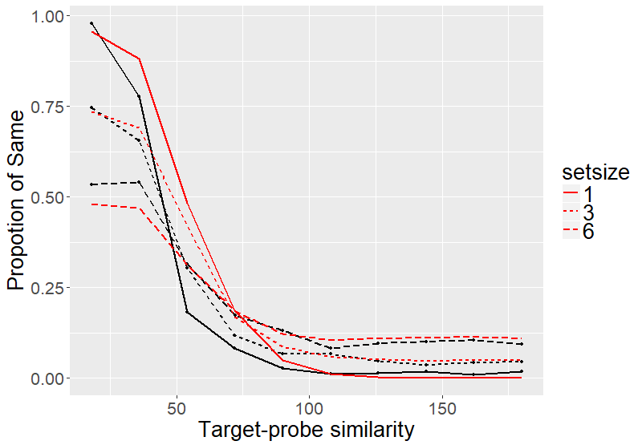
```
</center>
</div>


## VP-Binding

- Assumes color-location binding.
- Resources allocated to an item also determines the strength of binding.

<div class="columns-2">
Set-size effect
<center>
```{r, out.width = "500px"}
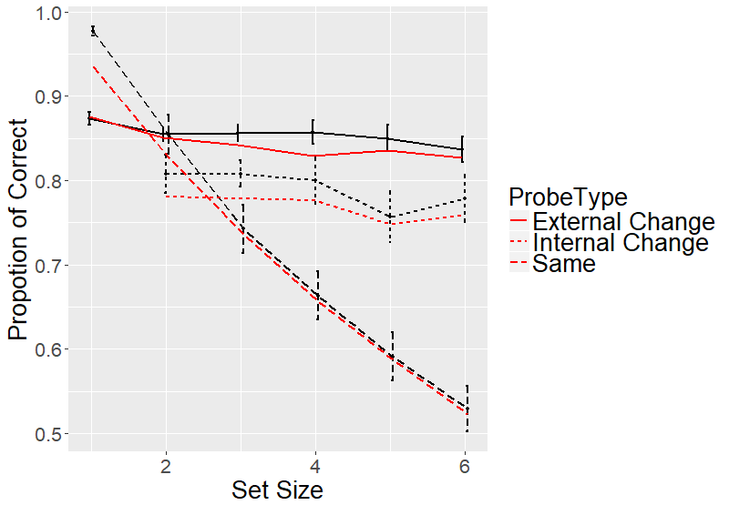
```
</center>


Similarity gradient
<center>
```{r, out.width = "500px"}
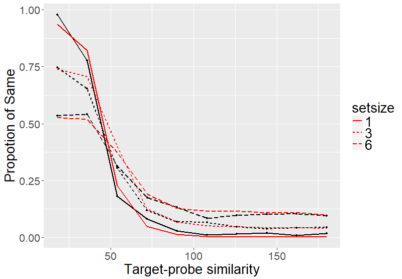
```
</center>
</div>


## Spatial Gradient Effect

<center>
```{r, out.width = "700px"}
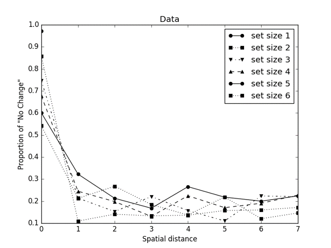
```
</center>