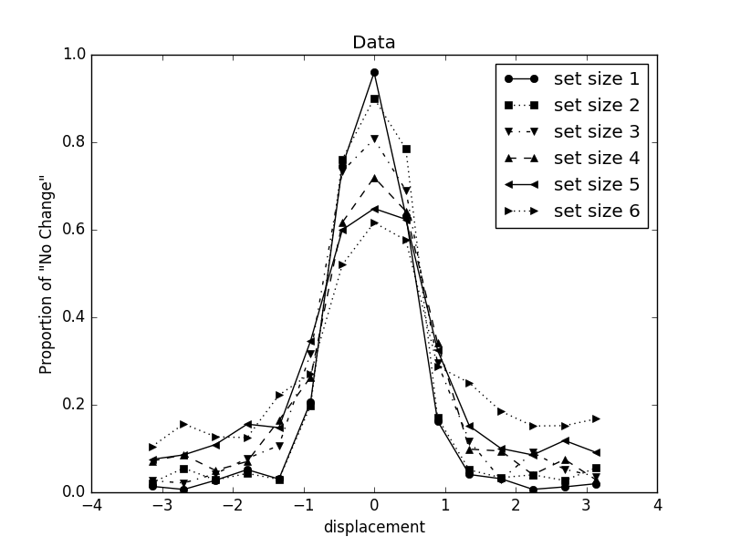

```{r setup, include=FALSE}
knitr::opts_chunk$set(echo = TRUE)
```

## Experiment object
In this experiment, we tried to determine how the similarity between the probe (the item we asked you to judge) and the target affects on your judgement. In previous experiments, we found that the participants are more likely to accept the probe if it's similar to the target, despite there is a small difference.

```{r, out.width = "480px"}

```

However, when we tried to implement a computational model to the data from previous experiment, we found that the experiment setting violets some assumptions in the models, e.g., the probability of probe having exactly the same color as the target isn't 50%. The violation of the model assumption isn't very critical if the model performs really well or poorly. If the model performed well, we know the violation isn't important, and we can still claim success. If the model performed poorly, we know the model is helpless. We would be better to come up with a new one.

Unfortunately, the model did a pretty good job, but it's not good enough that we can truly clam a success. We can't be really sure if the unsuccessful of the model is because of the assumption violation or a mistake by the model. Therefore, in this experiment, we tried to test the same thing again. However, this time we made sure that the experiment setting follows the model assumption. So we would have know that if the model really is successful or not.

If you want to know more about the related experiment. You can read [@keshvari2013no] for more information.

## References